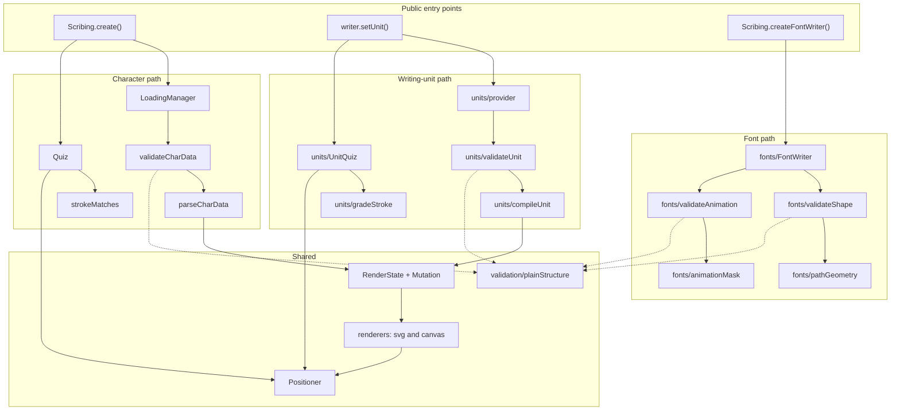

# Architecture

Scribing holds three largely independent subsystems that share a render target and very
little else. Knowing which one you are in answers most questions about where code lives.

## The three paths

**Character path.** The inherited Hanzi Writer model: filled SVG outlines plus one
ordered centerline per stroke, in a fixed 1024-unit coordinate box. `LoadingManager`
fetches, `validateCharData` checks the shape, `parseCharData` builds the model, `Quiz`
grades input through `strokeMatches` (Fréchet distance over normalized curves).

**Writing-unit path.** The v2 model: native centerlines, true dots, source metrics and
alternative order plans, carrying their own coordinate frame and bounds.
`createDataProvider` owns an immutable pack, `compileUnit` turns a unit into strokes,
`UnitQuiz` grades through `gradeStroke` (arc-length resampling against a tolerance in
em units). Coexists with the character path but does not share its grading.

**Font path.** Real filled outlines from a TTF or OTF file. `FontWriter` renders and
captures input; `validateShape` and `pathGeometry` measure the outlines;
`validateAnimation` and `animationMask` drive the stroke-order reveal. Grading here is
deliberately unordered: `check()` reports raster overlap, never a stroke sequence.

## Shared machinery

**`validation/plainStructure`** is the single hardened reader all four validators use.
See [SECURITY.md](../SECURITY.md) for what it defends against and why it is one module
rather than four copies.

**`RenderState` and `Mutation`** are the animation engine: a mutation chain per scope,
cancellable, with scope-prefix matching so starting one animation cancels the ones it
supersedes.

**`Positioner`** maps between the caller's pixel box and the model's coordinate frame,
in both directions. Everything that converts a pointer event goes through it.

**Renderers** live under `src/renderers/{svg,canvas}` behind a shared base. The font
path does _not_ use them; `FontWriter` draws directly, because it works in font units
with its own fit and has no stroke model to render.

## What is optional and what ships

| Location                 | Ships in the npm package | Notes                                                                                                         |
| ------------------------ | ------------------------ | ------------------------------------------------------------------------------------------------------------- |
| `src/`                   | yes, as `dist/`          | The library. Zero runtime dependencies.                                                                       |
| `extras/fonts/`          | yes                      | Optional HarfBuzz provider and animation preparer. Imported explicitly; the core bundle contains no HarfBuzz. |
| `extras/fonts/vendor/`   | yes                      | Unchanged HarfBuzzJS 1.6.1 and its WASM, hash-pinned.                                                         |
| `fonts/assets/`          | no                       | ~169 MB of Noto binaries. Not in git either; restored with `yarn fetch-fonts`.                                |
| `fonts/motor/`, `packs/` | no                       | Optional stroke inventories and data packs. In git, excluded from the tarball.                                |
| `demo/`, `scripts/`      | no                       | Demo pages and the check harness.                                                                             |

`scripts/check-package.cjs` asserts this table against a real `npm pack` tarball.

## Where the algorithms are

The genuinely hard code is the font animation preparer, and almost all of it is in
`extras/fonts/`, not `src/`:

- `skeleton.mjs` — medial-axis thinning, graph trails, junction repair. The largest and
  most complex module in the repository.
- `progress.mjs` — per-pixel stroke ownership and arc-length progress assignment.
- `animation.mjs` — plan preparation, source adaptation, provenance classification.
- `provider.mjs` — SFNT validation and HarfBuzz shaping.

`src/fonts/animationMask.ts` consumes their output: it reconstructs a smooth scalar
field from the per-cell progress values and emits the marching-squares reveal contour.
That one _is_ unit tested; see `src/fonts/__tests__/animationMask-test.ts`.
